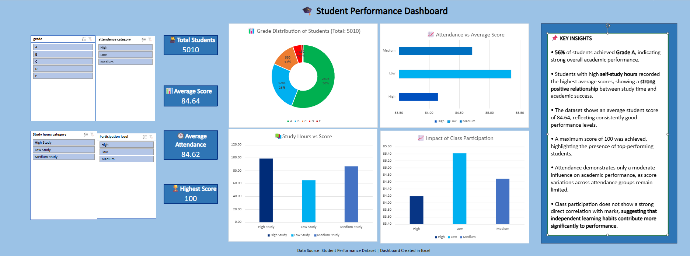

# Student Performance Analysis Dashboard

## Project Overview

This project analyzes the academic performance of 5,010 students using Microsoft Excel. The dashboard provides insights into student grades, attendance, study habits, and class participation.

## Dashboard Preview

## Tools Used

* Microsoft Excel
* Pivot Tables
* Pivot Charts
* Slicers
* Dashboard Design

## Key Metrics

* Total Students: 5,010
* Average Score: 84.64
* Average Attendance: 84.62%
* Highest Score: 100

## Analysis Performed

* Grade Distribution Analysis
* Attendance vs Average Score
* Study Hours vs Score
* Impact of Class Participation
* Interactive Filtering using Slicers

## Key Insights

* More than half of the students achieved Grade A.
* Students with higher study hours generally performed better.
* Attendance showed a moderate relationship with academic performance.
* Study habits had a stronger impact on scores than class participation.

## Skills Demonstrated

* Data Cleaning
* Data Analysis
* Data Visualization
* Dashboard Development
* Business Insight Generation

## Author

Hiniyasri P
Aspiring Data Analyst
